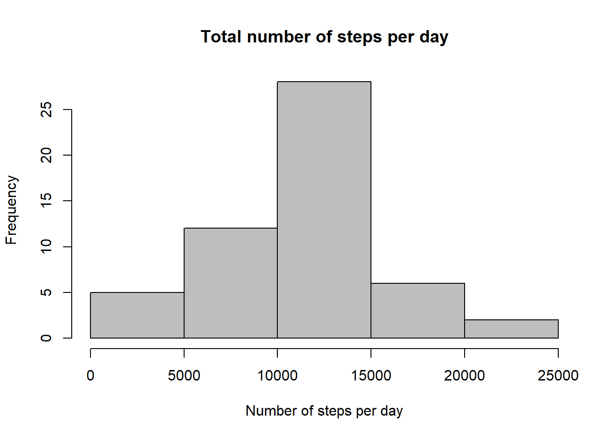
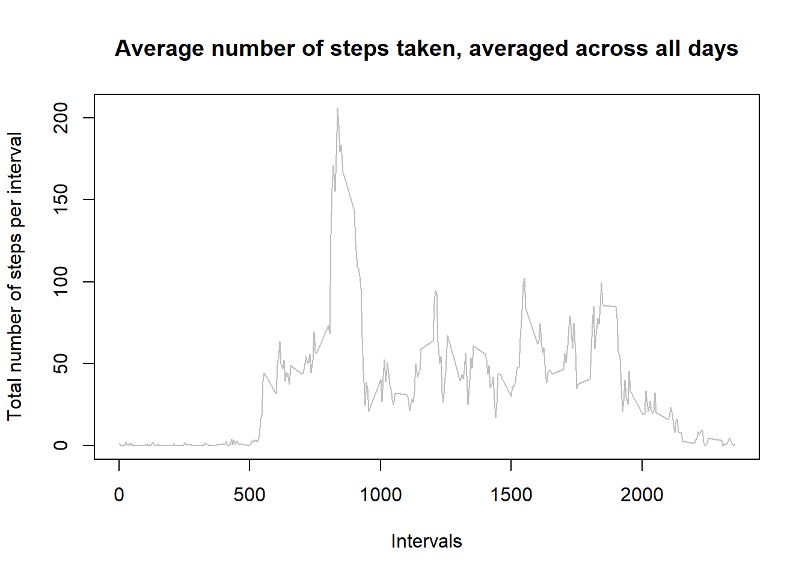
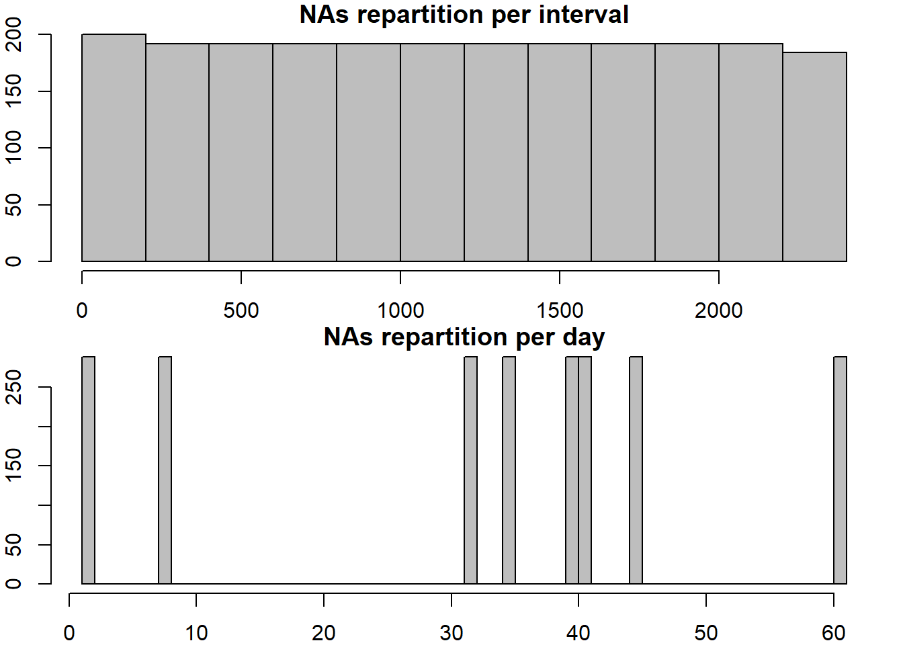
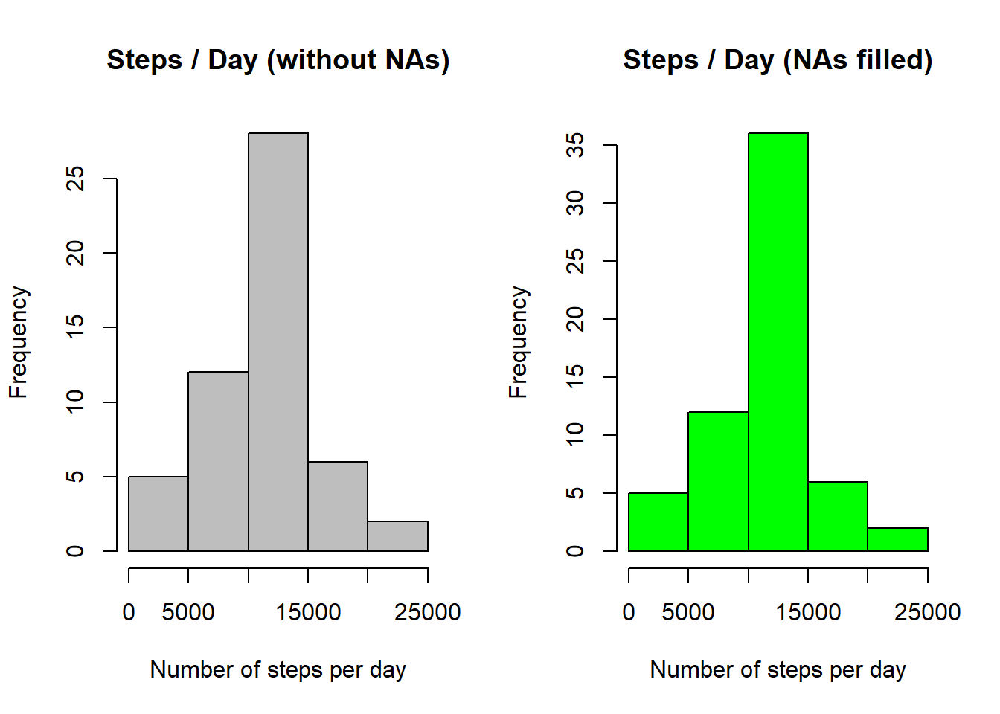
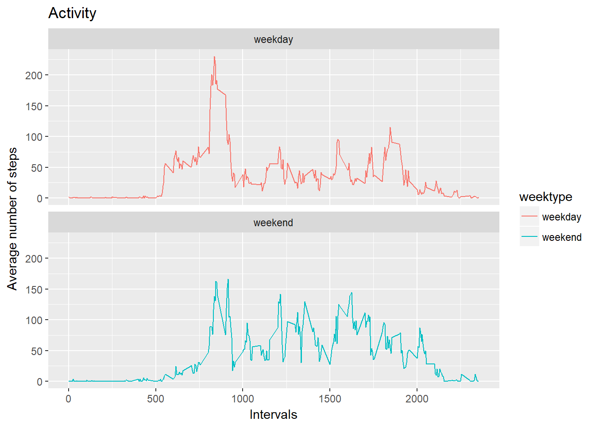

# Reproducible Research: Peer Assessment 1

---
output: 
  html_document:
    keep_md: true
---

```{r, echo=FALSE, results='hide', warning=FALSE, message=FALSE}
library(xtable)
library(ggplot2)
library(lubridate)
library(bindrcpp)
```

## Loading and preprocessing the data

```{r, echo=TRUE}
rm(list=ls())

if(!file.exists("activity.csv")) {
    tempfile <- tempfile()
    download.file("https://d396qusza40orc.cloudfront.net/repdata%2Fdata%2Factivity.zip")
    unzip(tempfile)
    unlink(tempfile)
}

activity <- read.csv("activity.csv")
```

## What is mean total number of steps taken per day?

##### 1. Calculate the total number of steps taken per day

We use the aggregate function and we remove NAs as below:

```{r, echo=TRUE}
activity_steps_day <- aggregate(steps ~ date, data = activity, FUN = sum, na.rm = TRUE)
```

##### 2. Make a histogram of the total number of steps taken each day

```{r, echo=TRUE}
hist(activity_steps_day$steps, xlab = "Number of steps per day", main = "Total number of steps per day",col="grey")
```

 

##### 3. Calculate and report the mean and median of the total number of steps taken per day

```{r, echo=TRUE}
mean_steps <- mean(activity_steps_day$steps)
median_steps <- median(activity_steps_day$steps)
mean_steps <- format(mean_steps,digits = 1)
median_steps <- format(median_steps,digits = 1)
```

* Mean steps per day: 10766
* Median steps per day:  10765

-----


## What is the average daily activity pattern?

##### 1. Making a time series plot

We use the aggregate function and we remove NAs as below:

```{r, echo=TRUE}
activity_average_daily <- aggregate(steps ~ interval, data = activity, FUN = mean, na.rm = TRUE)
```

We get the plot as below:

```{r, echo=TRUE}
plot(activity_average_daily$interval, activity_average_daily$steps, type = "l", col = "grey", xlab = "Intervals",
     ylab = "Total number of steps per interval", main = "Average number of steps taken, averaged across all days") 
```

 

##### 2. Which 5-minute interval, on average across all the days in the dataset, contains the maximum number of steps?

```{r, echo=TRUE}
maximum_steps <- max(activity_average_daily$steps)
maximum_interval <- activity_average_daily$interval[which(activity_average_daily$steps == maximum_steps)]
maximum_steps <- format(maximum_steps, digits = 1)
```

* Highest number of steps for 5-minutes-interval: 206
* Corresponding interval:  835

----


## Imputing missing values

##### 1. Calculate and report the total number of missing values in the dataset

```{r, echo=TRUE}
mv <- sum(is.na(activity))
```

* Number of missing values: 2304

##### 2. Devise a strategy for filling in all of the missing values in the dataset

We plot the number of missing values per interval and per day to understand which method we should consider.

```{r, echo=TRUE}
missing_values <- subset(activity, is.na(steps))
par(mfrow = c(2,1), mar = c(2, 2, 1, 1))
hist(missing_values$interval, main = "NAs repartition per interval", col = "grey")
hist(as.numeric(missing_values$date), main = "NAs repartition per day", breaks = 80, col="grey")
```

 

We notice a uniform distribution of NAs in the intervals. However, NA's are in only 8 days. Hence, we should take the mean for missing interval across all the days in the dataset.

##### 3. Create a new dataset that is equal to the original dataset but with the missing data filled in

Hence, the method will be as below:
* Average number of steps per interval, across all the days, will be calculated
* The dataset _activity_ will be cut into two datasets: _activity_with_NAs_ and _activity_without_NAs_
* We will proceed as we said in the previous part
* Both datasets have been merged into a new dataset called _new_activity_

```{r, echo=TRUE}
#Mean of steps per interval
mean_steps_interval <- tapply(activity$steps, activity$interval, mean, na.rm = TRUE)
#Splitting
activity_with_NAs <- activity[is.na(activity$steps), ]
activity_without_NAs <- activity[!is.na(activity$steps), ]
#Replacing missing values in activity_with_NAs
activity_with_NAs$steps <- as.factor(activity_with_NAs$interval)
#using as.factor() because factor() could remove empty levels
levels(activity_with_NAs$steps) <- mean_steps_interval
#Getting integer 
levels(activity_with_NAs$steps) <- round(as.numeric(levels(activity_with_NAs$steps)))
activity_with_NAs$steps <- as.integer(as.vector(activity_with_NAs$steps))
#Merging the two datasets
new_activity <- rbind(activity_with_NAs, activity_without_NAs)
```

##### 4. Make a histogram of the total number of steps taken each day 

First we want to get of the total number of steps taken each day. Two datasets will be compared: one with NAs nd one with flled NAs.

```{r, echo=TRUE}
par(mfrow = c(1,2))
activity_steps_day <- aggregate(steps ~ date, data = activity, FUN = sum, na.rm = TRUE)
hist(activity_steps_day$steps, xlab = "Number of steps per day", main = "Steps / Day (without NAs)",col="grey")
new_activity_steps_day <- aggregate(steps ~ date, data = new_activity, FUN = sum, na.rm = TRUE)
hist(new_activity_steps_day$steps, xlab = "Number of steps per day", main = "Steps / Day (NAs filled)", col = "green")
```

 

Then, we calculate the new mean and median values and we store them with the previous results in a table with the package xtable.

```{r, echo=TRUE}
new_mean_steps <- mean(new_activity_steps_day$steps)
new_median_steps <- median(new_activity_steps_day$steps)
new_mean_steps <- format(new_mean_steps,digits = 1)
new_median_steps <- format(new_median_steps,digits = 1)

results <- data.frame(c(mean_steps, median_steps), c(new_mean_steps, new_median_steps))
colnames(results) <- c("without NAs", "NAs filled")
rownames(results) <- c("mean", "median")
table_results <- xtable(results)
print(table_results, type = "html")
```

Finally, ignoring missing values does not change the mean value (which is 10766) but the median value is reduced only by 0.027% (from 10765 to 10762). Besides, both histograms have the same behavior.


## Are there differences in activity patterns between weekdays and weekends?


##### 1. Create a new factor variable in the dataset

```{r, echo=TRUE}
#ifelse function is able to consider Saturday and Sunday as the factor level "weekend" and all the others as "weekday"
new_activity$weektype <- ifelse(weekdays(as.Date(new_activity$date)) == "samedi" | weekdays(as.Date(new_activity$date)) == "dimanche", "weekend", "weekday")
#Transforming DayType variable into a factor
new_activity$weektype <- factor(new_activity$weektype)
```

As I am French, I put "samedi" and "dimanche" but you can easily replace it by "saturday" and "sunday".

##### 2. Make a panel plot containing a time series plot

```{r, echo=TRUE}
activity_steps_interval_weektype<- aggregate(steps ~ interval + weektype, data = new_activity, FUN = mean)
```

```{r, echo=TRUE}
plot <- ggplot(activity_steps_interval_weektype, aes(interval, steps, color = weektype)) + geom_line() + facet_grid(weektype~.) + facet_wrap(~weektype, ncol = 1, nrow = 2) + labs(x = "Intervals", y = "Average number of steps", title = "Activity")
print(plot)
```

 

Overall, it seems that people are ready earlier in the week days with a higher peak in the morning. During the weekends, people are more active all the day than during the weekdays.
